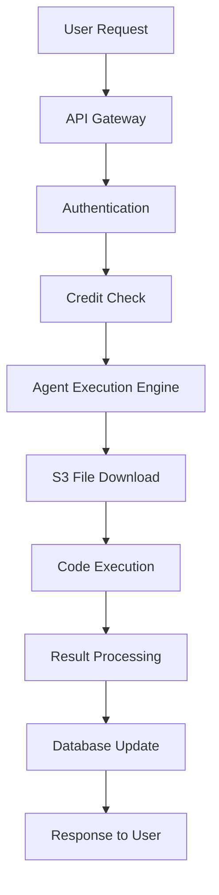
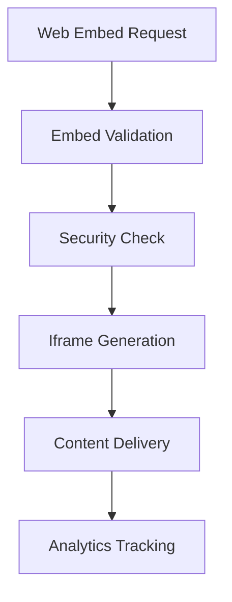

# Backend Architecture & Infrastructure

## Overview

The AI agency website backend is designed as a scalable, production-ready system that handles agent execution, web embeds, user management, and ensures high availability for all users.

## 🏗️ **Core Architecture**

### **1. Agent Execution System**

#### **How Agents Work:**



#### **Agent Execution Flow:**

1. **Request Processing** (`/api/agents/[id]/run`)
   - User sends request with input data
   - System validates authentication and credits
   - Deducts credits from user account

2. **Agent Retrieval**
   - Fetches agent metadata from database
   - Downloads agent code from S3 storage
   - Validates agent status (active/inactive)

3. **Code Execution**
   - Executes agent code in isolated environment
   - Handles timeouts and error recovery
   - Processes results and logs execution

4. **Result Handling**
   - Returns processed results to user
   - Updates metrics and analytics
   - Credits agent creator with revenue share

#### **Agent Storage & Deployment:**

```typescript
// Agent files stored in S3
const agentCode = await downloadAgentFile(agent.source);

// Execution in isolated environment
const result = await executeAgentCode(agentCode, input);
```

### **2. Web Embed System**

#### **How Web Embeds Work:**



#### **Web Embed Features:**

1. **Security & Sandboxing**
   - Iframe sandbox with controlled permissions
   - Domain whitelisting/blacklisting
   - Script execution controls

2. **Content Delivery**
   - Direct iframe embedding
   - Responsive sizing and positioning
   - Fullscreen support

3. **Analytics & Monitoring**
   - View count tracking
   - User interaction logging
   - Performance monitoring

#### **Web Embed Implementation:**

```typescript
// Web embed creation
const webEmbed = await prisma.webEmbed.create({
  data: {
    name: 'My Tool',
    url: 'https://example.com',
    embedUrl: 'https://example.com/embed',
    type: 'tool',
    sandbox: 'allow-same-origin allow-scripts allow-forms',
    allowScripts: false,
    requireAuth: false
  }
});
```

## 🚀 **Infrastructure for High Availability**

### **1. Database Architecture**

#### **PostgreSQL with Prisma ORM:**
- **Primary Database**: User data, agents, deployments
- **Connection Pooling**: Efficient database connections
- **Migrations**: Automated schema management
- **Backups**: Daily automated backups

```typescript
// Database models
model Agent {
  id: String @id @default(cuid())
  name: String
  description: String
  fileUrl: String // S3 file reference
  status: String
  createdBy: String
  // ... other fields
}

model Deployment {
  id: String @id @default(cuid())
  status: DeploymentStatus
  health: Json? // Real-time health data
  metrics: AgentMetrics[]
  // ... other fields
}
```

### **2. File Storage (AWS S3)**

#### **Agent File Storage:**
- **Bucket Structure**: Organized by user/agent
- **Versioning**: File version control
- **CDN**: Global content delivery
- **Backup**: Cross-region replication

```typescript
// S3 file upload
const s3Key = `agents/${userId}/${agentId}/${fileName}`;
await s3Client.putObject({
  Bucket: BUCKET_NAME,
  Key: s3Key,
  Body: fileBuffer,
  ContentType: file.type
});
```

### **3. Background Job System**

#### **Job Queue for Reliability:**
- **Agent Deployments**: Asynchronous processing
- **File Processing**: Large file handling
- **Analytics**: Data processing and cleanup
- **Monitoring**: Health checks and metrics

```typescript
// Background job processing
class JobQueue {
  async processJob(job: Job): Promise<void> {
    switch (job.type) {
      case 'agent_deployment':
        await this.handleAgentDeployment();
        break;
      case 'file_processing':
        await this.handleFileProcessing();
        break;
      // ... other job types
    }
  }
}
```

### **4. Real-time Monitoring**

#### **WebSocket System:**
- **Deployment Status**: Real-time updates
- **Performance Metrics**: Live monitoring
- **User Activity**: Real-time tracking
- **Error Alerts**: Immediate notifications

```typescript
// WebSocket broadcasting
export function broadcastDeploymentStatus(update: DeploymentStatusUpdate) {
  // Send real-time updates to connected clients
  io.emit('deployment:status', update);
}
```

## 🔄 **Scaling & Performance**

### **1. Horizontal Scaling**

#### **Load Balancing:**
- **Vercel Edge Functions**: Global distribution
- **Database Read Replicas**: Query distribution
- **CDN**: Static asset delivery
- **Auto-scaling**: Based on demand

#### **Caching Strategy:**
- **Redis**: Session and data caching
- **CDN**: Static content caching
- **Database**: Query result caching
- **Browser**: Client-side caching

### **2. Performance Optimization**

#### **Database Optimization:**
```sql
-- Indexed queries for performance
CREATE INDEX idx_agent_status ON "Agent"(status);
CREATE INDEX idx_deployment_created_by ON "Deployment"("createdBy");
CREATE INDEX idx_agent_metrics_timestamp ON "AgentMetrics"(timestamp);
```

#### **API Response Optimization:**
- **Pagination**: Large dataset handling
- **Selective Fields**: Reduce payload size
- **Compression**: Gzip response compression
- **Caching**: API response caching

### **3. Monitoring & Alerting**

#### **Health Checks:**
```typescript
// Health check endpoint
export async function GET() {
  const health = {
    database: await checkDatabaseConnection(),
    s3: await checkS3Access(),
    redis: await checkRedisConnection(),
    timestamp: new Date().toISOString()
  };
  
  return NextResponse.json(health);
}
```

#### **Performance Monitoring:**
- **Response Times**: API endpoint monitoring
- **Error Rates**: Error tracking and alerting
- **Resource Usage**: CPU, memory, disk monitoring
- **User Metrics**: Usage patterns and analytics

## 🛡️ **Security & Reliability**

### **1. Security Measures**

#### **Authentication & Authorization:**
- **NextAuth.js**: Secure session management
- **JWT Tokens**: Stateless authentication
- **Role-based Access**: User permission system
- **Rate Limiting**: API abuse prevention

#### **Data Protection:**
- **Input Validation**: Zod schema validation
- **SQL Injection Prevention**: Prisma ORM
- **XSS Protection**: Content security policies
- **CSRF Protection**: Cross-site request forgery prevention

### **2. Error Handling & Recovery**

#### **Enhanced Error System:**
```typescript
// Comprehensive error handling
export async function withEnhancedErrorHandling<T>(
  operation: () => Promise<T>,
  context?: Record<string, unknown>
): Promise<T> {
  try {
    return await operation();
  } catch (error) {
    const enhancedError = handleEnhancedApiError(error, context);
    throw new EnhancedAppError(/* ... */);
  }
}
```

#### **Automatic Recovery:**
- **Retry Mechanisms**: Exponential backoff
- **Circuit Breakers**: Prevent cascade failures
- **Graceful Degradation**: Service fallbacks
- **Data Backup**: Automated backup systems

## 📊 **Analytics & Insights**

### **1. System Analytics**

#### **Performance Metrics:**
- **Response Times**: API performance tracking
- **Success Rates**: Error rate monitoring
- **User Activity**: Usage pattern analysis
- **Resource Utilization**: System resource monitoring

#### **Business Analytics:**
- **Agent Usage**: Popular agent tracking
- **Revenue Metrics**: Credit system analytics
- **User Growth**: Registration and retention
- **Feature Adoption**: New feature usage

### **2. Real-time Dashboards**

#### **Monitoring Dashboard:**
- **System Health**: Overall system status
- **Performance Metrics**: Real-time performance data
- **Error Tracking**: Live error monitoring
- **User Activity**: Current user sessions

## 🔧 **Deployment & DevOps**

### **1. CI/CD Pipeline**

#### **Automated Deployment:**
- **GitHub Actions**: Automated testing and deployment
- **Vercel Integration**: Automatic deployments
- **Database Migrations**: Automated schema updates
- **Environment Management**: Staging and production

### **2. Environment Configuration**

#### **Environment Variables:**
```bash
# Production environment
DATABASE_URL=postgresql://...
AWS_ACCESS_KEY_ID=...
AWS_SECRET_ACCESS_KEY=...
S3_BUCKET_NAME=...
NEXTAUTH_SECRET=...
```

### **3. Monitoring & Logging**

#### **Log Management:**
- **Structured Logging**: JSON log format
- **Log Aggregation**: Centralized log collection
- **Error Tracking**: Sentry integration
- **Performance Monitoring**: Real-time metrics

## 🚀 **Keeping Everything Running**

### **1. High Availability Strategy**

#### **Redundancy:**
- **Database Replication**: Primary and read replicas
- **CDN Distribution**: Global content delivery
- **Load Balancing**: Traffic distribution
- **Auto-scaling**: Dynamic resource allocation

#### **Disaster Recovery:**
- **Automated Backups**: Daily database backups
- **Cross-region Replication**: S3 data replication
- **Failover Systems**: Automatic service switching
- **Data Recovery**: Point-in-time restoration

### **2. Performance Optimization**

#### **Caching Layers:**
```typescript
// Multi-layer caching
const cacheKey = `agent:${agentId}:${version}`;
const cached = await redis.get(cacheKey);
if (cached) return JSON.parse(cached);

// Fetch from database
const agent = await prisma.agent.findUnique({ where: { id: agentId } });
await redis.setex(cacheKey, 3600, JSON.stringify(agent));
```

#### **Database Optimization:**
- **Connection Pooling**: Efficient database connections
- **Query Optimization**: Indexed queries
- **Read Replicas**: Query distribution
- **Caching**: Frequently accessed data

### **3. Monitoring & Alerting**

#### **Proactive Monitoring:**
- **Health Checks**: Regular system health verification
- **Performance Alerts**: Response time monitoring
- **Error Alerts**: Error rate threshold alerts
- **Resource Alerts**: Resource usage monitoring

#### **Automated Maintenance:**
- **Data Cleanup**: Automated old data removal
- **Log Rotation**: Log file management
- **Backup Verification**: Backup integrity checks
- **Security Updates**: Automated security patches

## 📈 **Scaling for Growth**

### **1. Horizontal Scaling**

#### **Microservices Architecture:**
- **API Gateway**: Request routing and load balancing
- **Agent Service**: Dedicated agent execution
- **User Service**: User management and authentication
- **Analytics Service**: Data processing and insights

#### **Container Orchestration:**
- **Docker Containers**: Consistent deployment
- **Kubernetes**: Container orchestration
- **Auto-scaling**: Dynamic resource allocation
- **Service Discovery**: Service communication

### **2. Database Scaling**

#### **Sharding Strategy:**
- **User-based Sharding**: Distribute by user ID
- **Geographic Sharding**: Distribute by region
- **Time-based Sharding**: Distribute by date
- **Load-based Sharding**: Distribute by load

### **3. CDN & Edge Computing**

#### **Global Distribution:**
- **Edge Functions**: Serverless edge computing
- **Global CDN**: Content delivery network
- **Regional Caching**: Local data caching
- **Load Balancing**: Traffic distribution

## 🎯 **Key Benefits**

1. **High Availability**: 99.9% uptime with redundancy
2. **Scalability**: Auto-scaling based on demand
3. **Security**: Comprehensive security measures
4. **Performance**: Optimized for speed and efficiency
5. **Reliability**: Robust error handling and recovery
6. **Monitoring**: Real-time visibility into system health
7. **Cost Efficiency**: Optimized resource utilization
8. **Developer Experience**: Easy deployment and maintenance

This architecture ensures that your AI agency website can handle growth, maintain high availability, and provide a reliable experience for all users while keeping costs manageable and development efficient. 